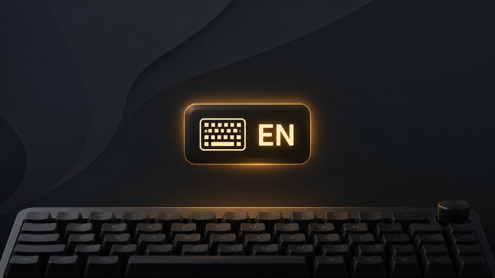

# Keyglow

[](https://github.com/0x1ocean/omarchy-keyglow/actions/workflows/test.yml)



Keyglow adds immediate keyboard-layout feedback to Omarchy's built-in keyboard
layout indicator. It uses Omarchy's native OSD and keeps the stock widget in
its usual place.

## Features

- Works with Omarchy's built-in keyboard layout widget instead of adding a second bar item.
- Shows the active layout immediately through Omarchy's native OSD.
- Reacts only to physical keyboard layout changes.
- Ignores Fcitx virtual-keyboard synchronization caused by changing windows.
- Runs without background helpers or accessibility access.

## Requirements

- Omarchy Quattro with the built-in keyboard layout widget enabled.
- No external runtime dependencies.

## Install

```sh
omarchy plugin add https://github.com/0x1ocean/omarchy-keyglow.git --enable
```

Keep `omarchy.keyboard-layout` enabled. It remains the visible indicator and
continues to handle click-to-cycle; Keyglow only supplies the OSD.

### Upgrade from 1.0.0

Version 1.0.0 was a separate bar widget. Remove its old bar entry before
updating, then enable the new background service and restore the stock widget:

```sh
omarchy plugin disable io.github.0x1ocean.keyglow
omarchy plugin update io.github.0x1ocean.keyglow --yes
omarchy plugin enable io.github.0x1ocean.keyglow
omarchy plugin enable omarchy.keyboard-layout center
```

## Remove

```sh
omarchy plugin remove io.github.0x1ocean.keyglow
```

## Development

```sh
omarchy plugin validate .
qmllint -I /usr/share/omarchy/shell Service.qml
node --test test/*.test.js
```

## License

MIT
